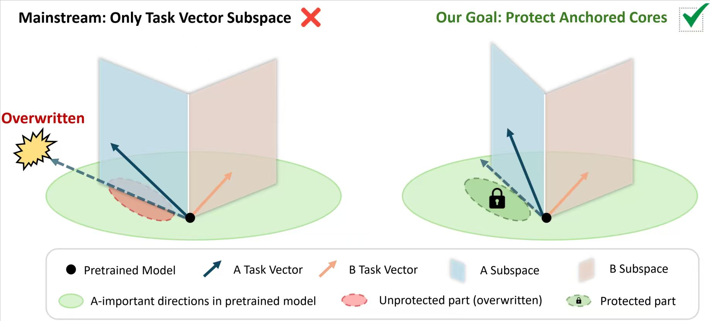

# PACT: Preserving Anchored Cores in Task-vectors for Model Merging



**PACT** (Preserving Anchored Cores in Task-vectors) addresses a fundamental issue in model merging: task-critical knowledge often remains embedded in pre-trained weights rather than being fully transferred into task vectors. We term these **Load-Bearing Wall (LBW) dimensions**. By ignoring LBW dimensions, existing task-vector-based approaches fail to fully resolve task conflicts and may inadvertently damage task-specific knowledge. PACT preserves these anchored cores by aligning their orthogonal complements with the subspace of pre-trained weights, then removing the aligned components from task vectors before merging. PACT can be seamlessly integrated with existing model merging methods (Task Arithmetic, TIES, DARE-TIES, Iso-C, etc.) and consistently improves performance, establishing new state-of-the-art results across multiple benchmarks.

## 📁 Repository Structure

```
pact-main/
├── full-finetune/      # Full-parameter model merging (ViT-B-16, ViT-L-14, 8 tasks)
│   ├── src/merging/    # Merging methods: Iso-C, Iso-CTS, PACT
│   ├── src/utils/      # PACT utilities (Fisher-guided SVD composition)
│   ├── config/         # Experiment configuration
│   └── analysis/       # Motivation experiments
│       ├── lbw_parameters/   # Scalar LBW pipeline (M0-M4)
│       └── lbw_subspaces/    # Subspace-level LBW analysis
│
└── lora/               # LoRA-based model merging (ViT-B/32, ViT-L/14, Llama3-8B)
    ├── configs/        # Experiment configs (PACT-TA, PACT-IsoC, and baselines)
    ├── training_scripts/  # Vision and language model fine-tuning
    ├── eval_scripts/   # Evaluation scripts
    ├── dataset/        # Data loading and head generation
    └── models/         # Model definitions
```

## 🚀 Quick Start

### Full Fine-Tuning
See [`full-finetune/README.md`](full-finetune/README.md) for environment setup, dataset preparation, and merging instructions. This branch follows the structure of [Iso-Merging](https://github.com/danielm1405/iso-merging).

### LoRA
See [`lora/README.md`](lora/README.md) for LoRA training, merging, and evaluation. This branch follows the structure of [KnOTS](https://github.com/gstoica27/KnOTS).

## 📦 Environment

Environment configuration files are provided for each branch:
- `full-finetune/pact_full.yml` — Conda environment for full fine-tuning experiments
- `lora/pact_lora.yml` — Conda environment for LoRA experiments

## 📚 Citation

If you use PACT in your research, please cite:

```bibtex
@misc{shi2026pactpreservinganchoredcores,
      title={PACT: Preserving Anchored Cores in Task-vectors for Model Merging},
      author={Ningyuan Shi and Zhipeng Zhou and Hao Wang and Chunyan Miao and Peilin Zhao},
      year={2026},
      eprint={2606.18627},
      archivePrefix={arXiv},
      primaryClass={cs.LG},
      url={https://arxiv.org/abs/2606.18627},
}
```

## 🤝 Acknowledgements

The full-finetune branch follows the structure of **[Iso-Merging](https://github.com/danielm1405/iso-merging)** (ICML 2025), which builds on [Task Singular Vectors](https://github.com/AntoAndGar/task_singular_vectors) and [Tall Masks](https://github.com/nik-dim/tall_masks). The LoRA branch follows the structure of **[KnOTS](https://github.com/gstoica27/KnOTS)** (ICLR 2025).

